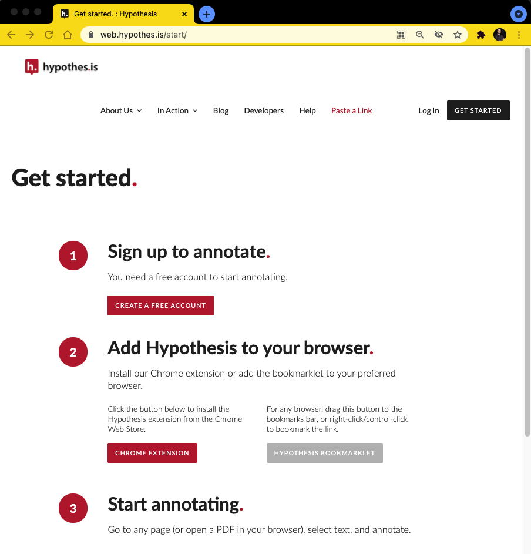

![Tool Logo][imglogo]

# Annotation via Hypothesis

## What is Hyptothesis

## Setting up Hyptothesis

- Works in Google [Chrome](https://www.google.com/intl/en_ca/chrome/) 
- Create [Account](https://web.hypothes.is/start/)
- Install [Extension](https://chrome.google.com/webstore/detail/hypothesis-web-pdf-annota/bjfhmglciegochdpefhhlphglcehbmek) 

## Method 1: Hyptothesis on the Open Web

- Once we have account setup
- Navigate to:
- - [The cost of the Suez Canal blockage]

## Method 2: Hypothesis in Sakai

**This tutorial is brought to you by the Brock University Digital Scholarship Lab.  For more information on the DSL check out our website at [www.brocku.ca/library/dsl/](https://brocku.ca/library/dsl/) or you can e-mail us at dsl@brocku.ca.**  

You can also find us on:  
[Facebook](https://www.facebook.com/Brock-University-Digital-Scholarship-Lab-349407235866792/)  
[Twitter](https://twitter.com/brock_dsl)  
[Instagram](https://www.instagram.com/brock_dsl/?hl=en)  
[YouTube](https://www.youtube.com/channel/UC2eEqPkDo-1N3qilxv-N_1g/featured?view_as=subscriber)

<!--- Please use reference style images so that it is easier to update pictures later --->

[imglogo]: INSERT LOGO FILENAME HERE
