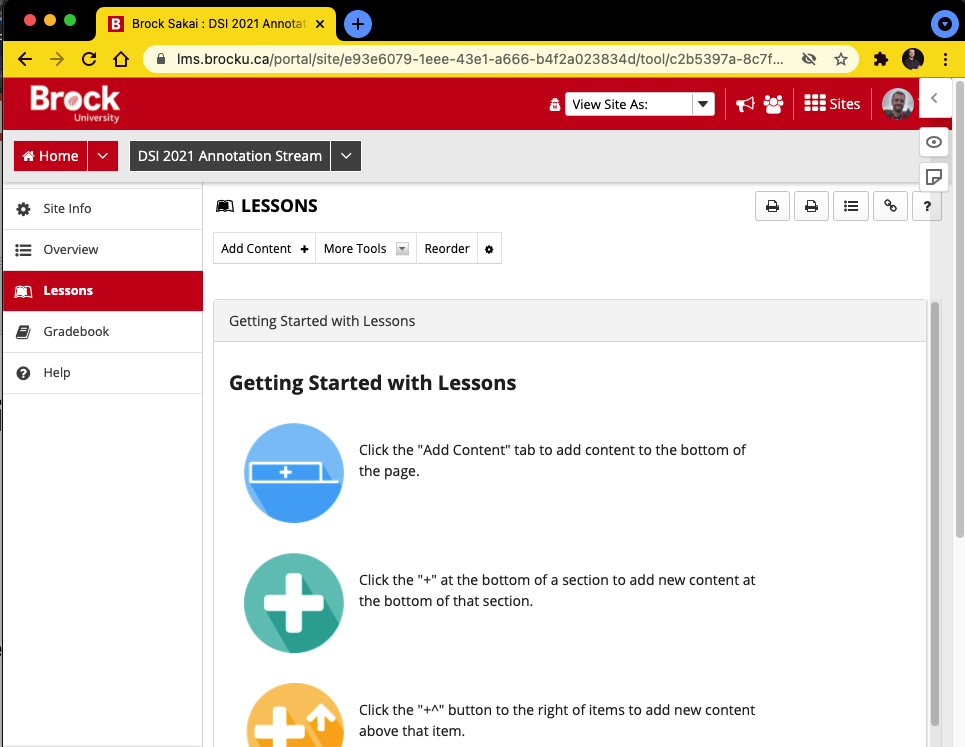
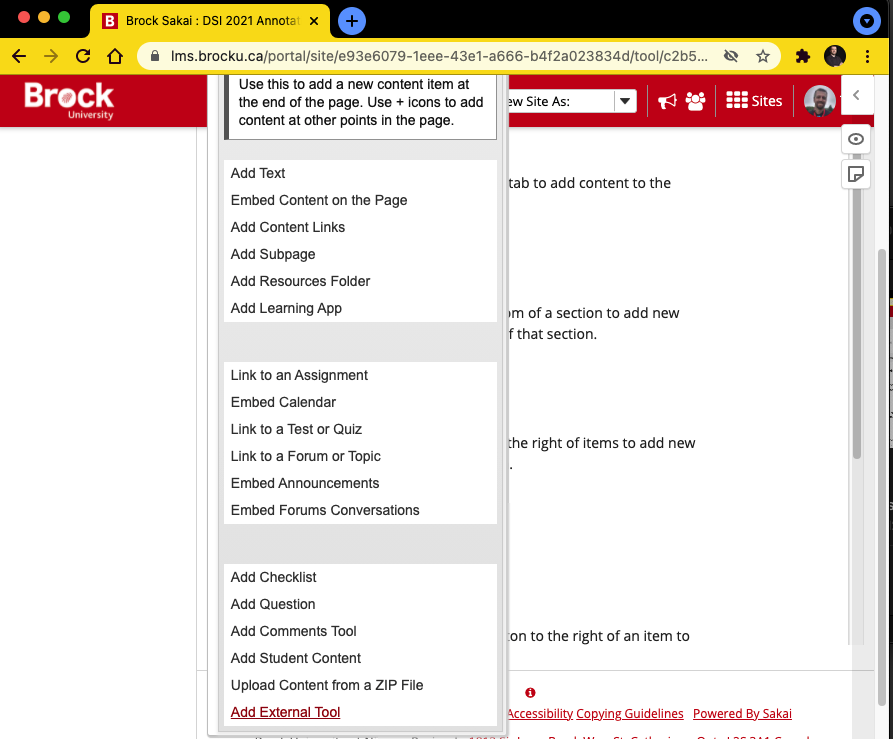
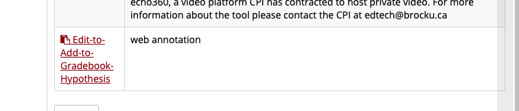
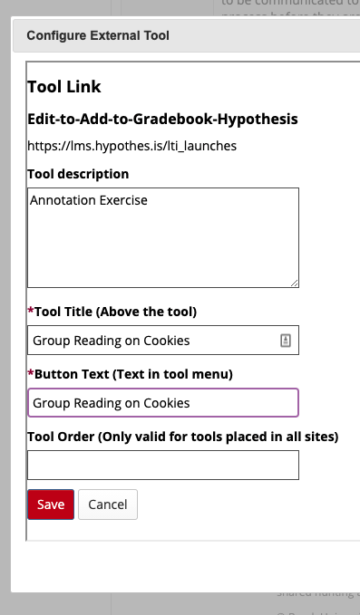
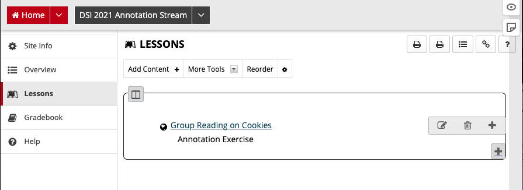
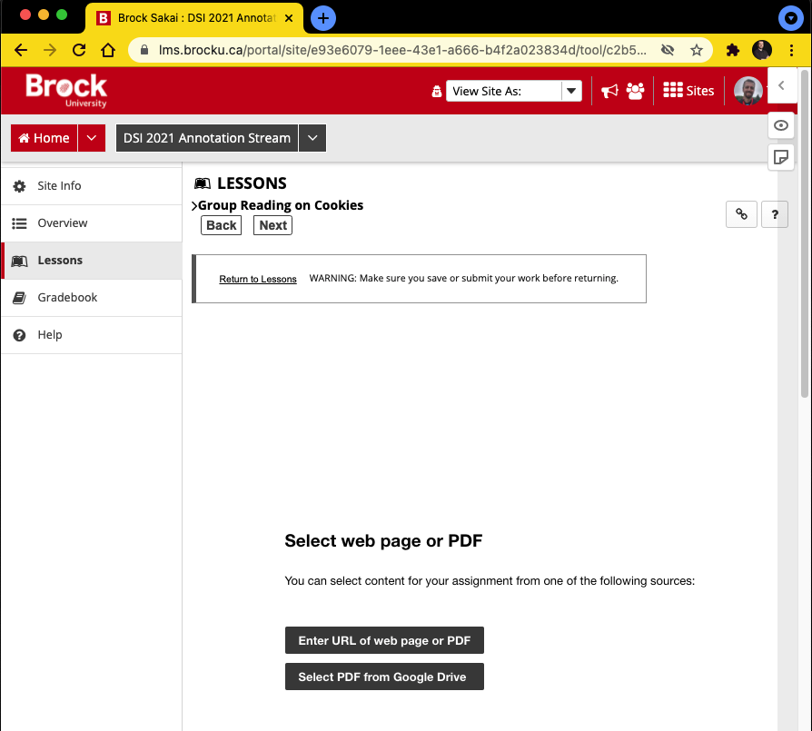

![Tool Logo][imglogo]

# Annotation via Hypothesis

## Method 2: Hypothesis in Sakai

## Basic Process

You can access Hyptothes.is via the **Lessons** tool in Sakai. You pick a file from a Google Drive location, or the public web. You can then mark the annotations added by students in the class

----

### Adding an Item in Sakai

1. Start from the Shared Sakai Site

2. **Lessons** Tab

3. **Add Content +**

4. **Add External Tool** -> **Edit-to-Add-to-Gradebook-Hypothesis**

5. Put your details in the dialog box

6. Will now be listed in **Lessons**, click to add link to Google Drive document or public webpage

   

**Step 1.**

**Step 2.**

**Step 3.**

**Step 4.**

**Step 5.**

**Step 6.**

----
### Marking an Item in Sakai

1. View Item
2. Assign a Grade
3. It will automatically get added to Gradebook (default to an _out of 10_ score)
**NB.** Brock re-upped subscription to the tool and it will be in place until at least end of 2021 fiscal. Longer if intersted in the tool continues.

**Step 1.**

**Step 2.**

**Step 3.**

----

### Additional Help

- [Using the Hyptothesis LMS App with Lessons in Sakai](https://web.hypothes.is/help/using-the-hypothesis-lms-app-with-lessons-in-sakai/)
- [Grading Student Annotations in Sakai](https://web.hypothes.is/help/grading-student-annotations-in-sakai/)

**This tutorial is brought to you by the Brock University Digital Scholarship Lab.  For more information on the DSL check out our website at [www.brocku.ca/library/dsl/](https://brocku.ca/library/dsl/) or you can e-mail us at dsl@brocku.ca.**  

You can also find us on:  
[Facebook](https://www.facebook.com/Brock-University-Digital-Scholarship-Lab-349407235866792/)  
[Twitter](https://twitter.com/brock_dsl)  
[Instagram](https://www.instagram.com/brock_dsl/?hl=en)  
[YouTube](https://www.youtube.com/channel/UC2eEqPkDo-1N3qilxv-N_1g/featured?view_as=subscriber)

<!--- Please use reference style images so that it is easier to update pictures later --->

[imglogo]: INSERT LOGO FILENAME HERE
